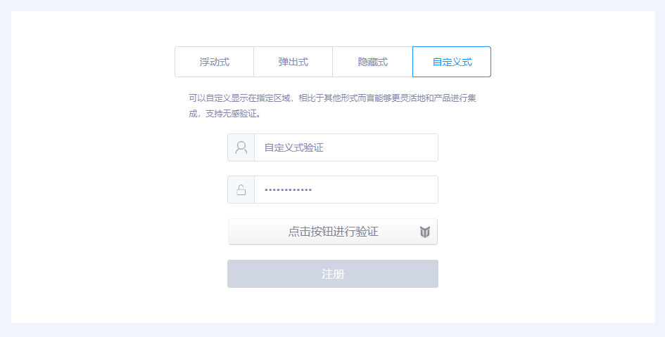

## YoTest-Vue-SDK 文档

<a href="https://www.npmjs.com/package/yotest-vue-sdk"></a>

> 基于虚拟机保护、设备特征识别和操作行为识别的新一代智能验证码，具备智能评分、抗 Headless、模拟伪装、针对恶意设备自动提升验证难度等多项安全措施，帮助开发者减少恶意攻击导致的数字资产损失，强力护航业务安全。

- [仓库入口](https://github.com/YoTest-team/YoTest-Vue-SDK#%E4%BB%93%E5%BA%93%E5%85%A5%E5%8F%A3)
- [兼容性](https://github.com/YoTest-team/YoTest-Vue-SDK#%E5%85%BC%E5%AE%B9%E6%80%A7)
- [安装](https://github.com/YoTest-team/YoTest-Vue-SDK#%E5%AE%89%E8%A3%85)
- [快速开始](https://github.com/YoTest-team/YoTest-Vue-SDK#%E5%BF%AB%E9%80%9F%E5%BC%80%E5%A7%8B)
- [验证模式](https://github.com/YoTest-team/YoTest-Vue-SDK#%E9%AA%8C%E8%AF%81%E6%A8%A1%E5%BC%8F)
- [API](https://github.com/YoTest-team/YoTest-Vue-SDK#api)

### 仓库入口：

<a href="https://gitee.com/yo-test-team/yo-test-vue-sdk"></a>&nbsp;&nbsp;
<a href="https://github.com/YoTest-team/YoTest-Vue-SDK"></a>

### 兼容性

- Vue2.x
- Vue3.x

### 安装

> npm install yotest-vue-sdk --save

### 快速开始

当你使用 npm 进行安装后，你可以通过 import 直接引入

```html
<template>
  <div id="app">
    <YoTest id="captcha" 
            accessId="your accessId" 
            @success="onSuccessHandler" 
            @error="onErrorHandler"> 
    </YoTest>
  </div>
</template>

<script>
  import YoTest from "yotest-vue-sdk";
  export default {
    components: {
      YoTest,
    },
    methods: {
      onSuccessHandler({token, verified}) {
        console.log("success", token, verified);
      },
      onErrorHandler({code, message}) {
        console.log("error", code, message);
      }
    }
  };
</script>

<style>
  #captcha {
    width: 300px;
    height: 40px;
  }
</style>
```

### 验证模式

- 浮动式，默认 PC 展现形式，移动端不支持此模式，展示为弹窗式，设置 product: "float" 时生效


```html
<template>
  <div id="app">
    <YoTest id="captcha" 
            accessId="your accessId" 
            product="float"
            @success="onSuccessHandler" 
            @error="onErrorHandler"> 
    </YoTest>
  </div>
</template>

<script>
  import YoTest from "yotest-vue-sdk";
  export default {
    components: {
      YoTest,
    },
    methods: {
      onSuccessHandler({token, verified}) {
        console.log("success", token, verified);
      },
      onErrorHandler({code, message}) {
        console.log("error", code, message);
      }
    }
  };
</script>

<style>
  #captcha {
    width: 300px;
    height: 40px;
  }
</style>
```

- 弹窗式，设置 product: "popup" 时生效


```html
<template>
  <div id="app">
    <YoTest id="captcha" 
            accessId="your accessId" 
            product="popup"
            @success="onSuccessHandler" 
            @error="onErrorHandler"> 
    </YoTest>
  </div>
</template>

<script>
  import YoTest from "yotest-vue-sdk";
  export default {
    components: {
      YoTest,
    },
    methods: {
      onSuccessHandler({token, verified}) {
        console.log("success", token, verified);
      },
      onErrorHandler({code, message}) {
        console.log("error", code, message);
      }
    }
  };
</script>

<style>
  #captcha {
    width: 300px;
    height: 40px;
  }
</style>
```

- 隐藏式，设置 product: "bind" 时生效，同时需要在 onReady 之后自行调用 [verify](https://github.com/YoTest-team/YoTest-Vue-SDK#verify) 方法进行展现


```html
<template>
  <div id="app">
    <YoTest ref="captcha"
            id="captcha" 
            accessId="your accessId" 
            product="bind"
            @ready="onReadyHandler"
            @success="onSuccessHandler" 
            @error="onErrorHandler"> 
    </YoTest>
  </div>
</template>

<script>
  import YoTest from "yotest-vue-sdk";
  export default {
    components: {
      YoTest,
    },
    methods: {
      onReadyHandler(){
        // 你也可以绑定事件，但需要注意：
        // 一定要在@ready之后进行verify的调用
        this.$refs.captcha.verify();
      },
      onSuccessHandler({token, verified}) {
        console.log("success", token, verified);
      },
      onErrorHandler({code, message}) {
        console.log("error", code, message);
      }
    }
  };
</script>

<style>
  #captcha {
    width: 300px;
    height: 40px;
  }
</style>
```

- 自定义式，设置 product: "custom" 时生效，同时需要设置 [area](https://github.com/YoTest-team/YoTest-Vue-SDK#area-string) 参数



```html
<template>
  <div id="app">
    <YoTest id="captcha" 
            accessId="your accessId" 
            product="custom"
            area="#app",
            bgColor="red"
            @success="onSuccessHandler" 
            @error="onErrorHandler"> 
    </YoTest>
  </div>
</template>

<script>
  import YoTest from "yotest-vue-sdk";
  export default {
    components: {
      YoTest,
    },
    methods: {
      onSuccessHandler({token, verified}) {
        console.log("success", token, verified);
      },
      onErrorHandler({code, message}) {
        console.log("error", code, message);
      }
    }
  };
</script>

<style>
  #captcha {
    width: 300px;
    height: 40px;
  }
</style>
```

### API

组件属性

- [accessId](https://github.com/YoTest-team/YoTest-Vue-SDK#accessid-string)
- [product](https://github.com/YoTest-team/YoTest-Vue-SDK#product-string)
- [area](https://github.com/YoTest-team/YoTest-Vue-SDK#area-string)
- [bgColor](https://github.com/YoTest-team/YoTest-Vue-SDK#bgcolor-string)
- [enforced](https://github.com/YoTest-team/YoTest-Vue-SDK#enforced-boolean)

组件方法

- [getValidate()](https://github.com/YoTest-team/YoTest-Vue-SDK#getvalidate)

- [reset()](https://github.com/YoTest-team/YoTest-Vue-SDK#reset)

- [verify()](https://github.com/YoTest-team/YoTest-Vue-SDK#verify)

- [destroy()](https://github.com/YoTest-team/YoTest-Vue-SDK#destroy)

组件事件

- [@ready](https://github.com/YoTest-team/YoTest-Vue-SDK#ready)

- [@success](https://github.com/YoTest-team/YoTest-Vue-SDK#success)

- [@error](https://github.com/YoTest-team/YoTest-Vue-SDK#error)

- [@close](https://github.com/YoTest-team/YoTest-Vue-SDK#close)


### accessId \<String\>
必填，当前项目所属的accessId，可以在友验后台中进行相关获取及查看。

```html
<template>
  <div id="app">
    <YoTest id="captcha" accessId="your accessId"></YoTest>
  </div>
</template>

<script>
  import YoTest from "yotest-vue-sdk";
  export default {
    components: {
      YoTest,
    },
  };
</script>

<style>
  #captcha {
    width: 300px;
    height: 40px;
  }
</style>
```

### product \<String\>
 可选，默认值float，设置验证码的展现形式，其值包括浮动式（float）、弹出式（popup）、绑定式（bind）、自定义式（custom）四种，具体形式请参考 [验证模式](https://github.com/YoTest-team/YoTest-Vue-SDK#%E9%AA%8C%E8%AF%81%E6%A8%A1%E5%BC%8F) 进行选择。需要注意的是，移动端由于屏幕展现原因，是无法展现浮动式（float）的。

 ```html
<template>
  <div id="app">
    <YoTest id="captcha" 
            accessId="your accessId" 
            product="popup">
    </YoTest>
  </div>
</template>

<script>
  import YoTest from "yotest-vue-sdk";
  export default {
    components: {
      YoTest,
    },
  };
</script>

<style>
  #captcha {
    width: 300px;
    height: 40px;
  }
</style>
```

### area \<String\>
可选，仅当 product: "custom" 生效，其作用为设置验证区域。需要注意的是，请确保对应的DOM元素存在，且符合CSS Selector的规范（例如：#id、.class、tagName及其组合均为合法）。

```html
<template>
  <div id="app">
    <YoTest id="captcha" 
            accessId="your accessId" 
            product="custom"
            area="#app">
    </YoTest>
  </div>
</template>

<script>
  import YoTest from "yotest-vue-sdk";
  export default {
    components: {
      YoTest,
    },
  };
</script>

<style>
  #captcha {
    width: 300px;
    height: 40px;
  }
</style>
```

### bgColor \<String\>
可选，仅当 product: "custom" 生效，其设置对应验证区域的背景，支持HEX、RGB及RGBA的颜色格式。

```html
<template>
  <div id="app">
    <YoTest id="captcha" 
            accessId="your accessId" 
            product="custom"
            area="#app"
            bgColor="red">
    </YoTest>
  </div>
</template>

<script>
  import YoTest from "yotest-vue-sdk";
  export default {
    components: {
      YoTest,
    },
  };
</script>

<style>
  #captcha {
    width: 300px;
    height: 40px;
  }
</style>
```

### enforced \<Boolean\>
可选，默认值false，强制每一次都进行验证，取消无感验证。

```html
<template>
  <div id="app">
    <YoTest id="captcha" 
            accessId="your accessId"
            product="popup"
            :enforced="true">
    </YoTest>
  </div>
</template>

<script>
  import YoTest from "yotest-vue-sdk";
  export default {
    components: {
      YoTest,
    },
  };
</script>

<style>
  #captcha {
    width: 300px;
    height: 40px;
  }
</style>
```

### getValidate()

- `return`: \<Object\>
  - token \<String\> 当前验证的凭证，需要提交给后端来进行是否通过判断
  - verified \<Boolean\> 是否验证成功

获取当前验证结果。

```html
<template>
  <div id="app">
    <YoTest ref="captcha" 
            id="captcha" 
            accessId="your accessId"
            @close="onCloseHandler">
    </YoTest>
  </div>
</template>

<script>
  import YoTest from "yotest-vue-sdk";
  export default {
    components: {
      YoTest,
    },
    methods: {
      onCloseHandler() {
        const { captcha } = this.$refs;
        const { token, verified } = captcha.getValidate();
        console.log(token, verified);
      }
    }
  };
</script>

<style>
  #captcha {
    width: 300px;
    height: 40px;
  }
</style>
```

### reset()

- `return`: null

重置 Captcha 当前状态为初始化状态。

```html
<template>
  <div id="app">
    <button @click="onResetClickHandler">Reset</button>
    <YoTest ref="captcha" 
            id="captcha" 
            accessId="your accessId">
    </YoTest>
  </div>
</template>

<script>
  import YoTest from "yotest-vue-sdk";
  export default {
    components: {
      YoTest,
    },
    methods: {
      onResetClickHandler() {
        const { captcha } = this.$refs;
        captcha.reset();
      }
    }
  };
</script>

<style>
  #captcha {
    width: 300px;
    height: 40px;
  }
</style>
```


### verify()

- `return`: null

当 product: "bind" 时，调用此API可以呼出验证界面并要求验证。这种方式提供了更好的灵活性，方便开发者在不破坏原由功能和UI的情况下进行集成，但需要注意的是，请在@ready后进行调用。

```html
<template>
  <div id="app">
    <button @click="onVerifyClickHandler">获取验证码</button>
    <YoTest ref="captcha" 
            id="captcha"
            product="bind"
            accessId="your accessId">
    </YoTest>
  </div>
</template>

<script>
  import YoTest from "yotest-vue-sdk";
  export default {
    components: {
      YoTest,
    },
    methods: {
      onVerifyClickHandler() {
        const { captcha } = this.$refs;
        captcha.verify();
      }
    }
  };
</script>

<style>
  #captcha {
    width: 300px;
    height: 40px;
  }
</style>
```

### destroy()

- `return`: null

销毁当前验证实例。

```html
<template>
  <div id="app">
    <YoTest ref="captcha" 
            id="captcha"
            accessId="your accessId"
            @success="onSuccessHandler">
    </YoTest>
  </div>
</template>

<script>
  import YoTest from "yotest-vue-sdk";
  export default {
    components: {
      YoTest,
    },
    methods: {
      onSuccessHandler() {
        const { captcha } = this.$refs;
        captcha.destroy();
      }
    }
  };
</script>

<style>
  #captcha {
    width: 300px;
    height: 40px;
  }
</style>
```

### @ready

监听验证的初始化完成事件。

```html
<template>
  <div id="app">
    <YoTest ref="captcha" 
            id="captcha"
            accessId="your accessId"
            @ready="onReadyHandler">
    </YoTest>
  </div>
</template>

<script>
  import YoTest from "yotest-vue-sdk";
  export default {
    components: {
      YoTest,
    },
    methods: {
      onReadyHandler() {
        console.log("yotest init completed...");
      }
    }
  };
</script>

<style>
  #captcha {
    width: 300px;
    height: 40px;
  }
</style>
```

### @success

```html
<template>
  <div id="app">
    <YoTest ref="captcha" 
            id="captcha"
            accessId="your accessId"
            @success="onSuccessHandler">
    </YoTest>
  </div>
</template>

<script>
  import YoTest from "yotest-vue-sdk";
  export default {
    components: {
      YoTest,
    },
    methods: {
      onSuccessHandler({ token, verified }) {
        console.log(token, verified);
      }
    }
  };
</script>

<style>
  #captcha {
    width: 300px;
    height: 40px;
  }
</style>
```

### @error

验证错误的监听回调。

```html
<template>
  <div id="app">
    <YoTest ref="captcha" 
            id="captcha"
            accessId="your accessId"
            @error="onErrorHandler">
    </YoTest>
  </div>
</template>

<script>
  import YoTest from "yotest-vue-sdk";
  export default {
    components: {
      YoTest,
    },
    methods: {
      onErrorHandler({ code, message }) {
        console.log(code, message);
      }
    }
  };
</script>

<style>
  #captcha {
    width: 300px;
    height: 40px;
  }
</style>
```

### @close

验证关闭的监听回调。

```html
<template>
  <div id="app">
    <YoTest ref="captcha" 
            id="captcha"
            accessId="your accessId"
            @close="onCloseHandler">
    </YoTest>
  </div>
</template>

<script>
  import YoTest from "yotest-vue-sdk";
  export default {
    components: {
      YoTest,
    },
    methods: {
      onCloseHandler() {
        console.log("captcha close");
      }
    }
  };
</script>

<style>
  #captcha {
    width: 300px;
    height: 40px;
  }
</style>
```
